<div align="center">


# Fromages de France

**Encyclopédie du terroir fromager français.**
Une application mobile (PWA) pour explorer, filtrer et collectionner les fromages, région par région.

[](https://react.dev)
[](https://vite.dev)
[](https://www.typescriptlang.org)
[](https://vitest.dev)
[](#-logo--icônes)
[](.nvmrc)
[](https://fromageor.netlify.app)

</div>

---

Dix régions couvertes : **Auvergne-Rhône-Alpes** (51 fromages), **Hauts-de-France** (18), **Bourgogne-Franche-Comté** (16), **Occitanie** (14), **Centre-Val de Loire** (13), **Normandie** (13), **Bretagne** (12), **Grand Est** (12), **Île-de-France** (11) et **Corse** (10), soit 170 fiches — l'ossature UI/données accepte d'autres régions à la suite.

Réimplémentation en React + Vite + TypeScript d'un handoff de design haute-fidélité (design system **Organic** : Caprasimo/Figtree, palette terracotta/sauge/crème), fidèle aux couleurs, typographies, espacements et à la logique métier du prototype de référence.

## 📸 Aperçu

|                        🏠 Accueil                        |                       🧀 Fiche détaillée                       |                       🗺️ Carte de France                      |
| :------------------------------------------------------: | :------------------------------------------------------------: | :-----------------------------------------------------------: |
| 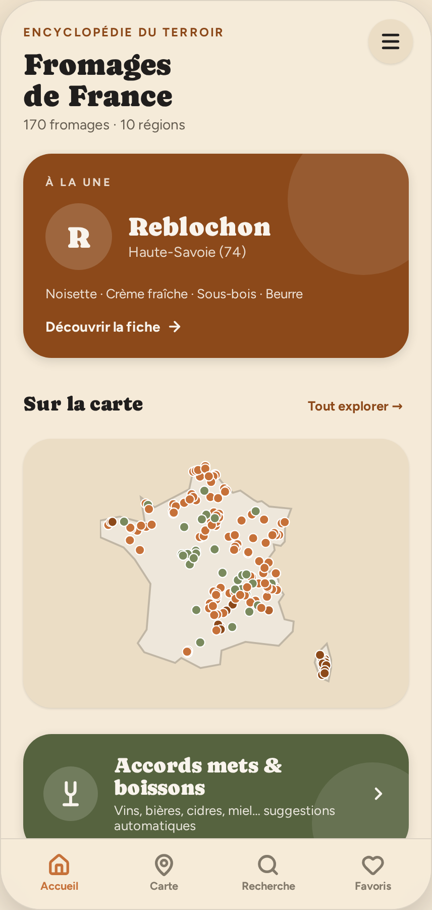 | 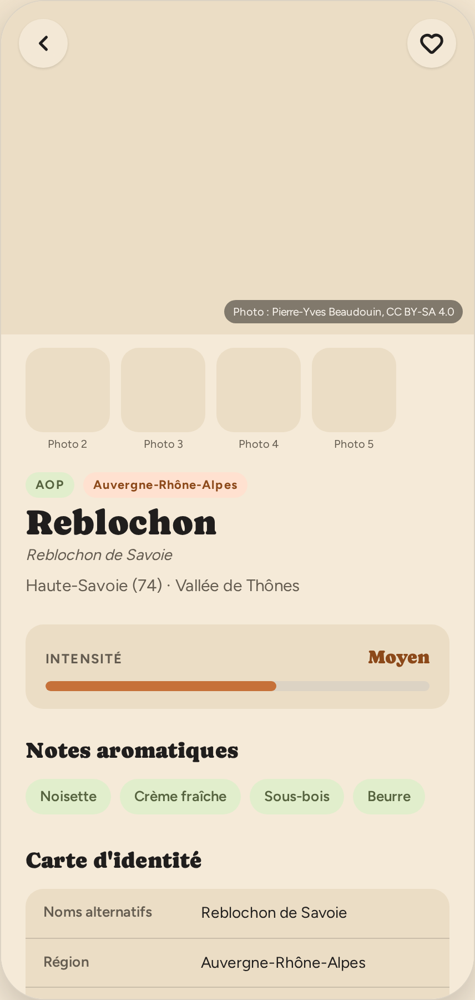 | 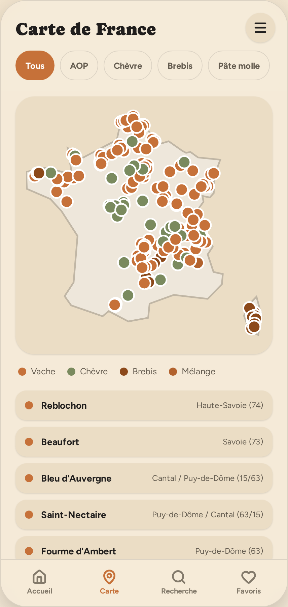 |
|                      **🔍 Recherche**                      |                         **❤️ Favoris**                         |                      **☰ Menu latéral**                      |
| 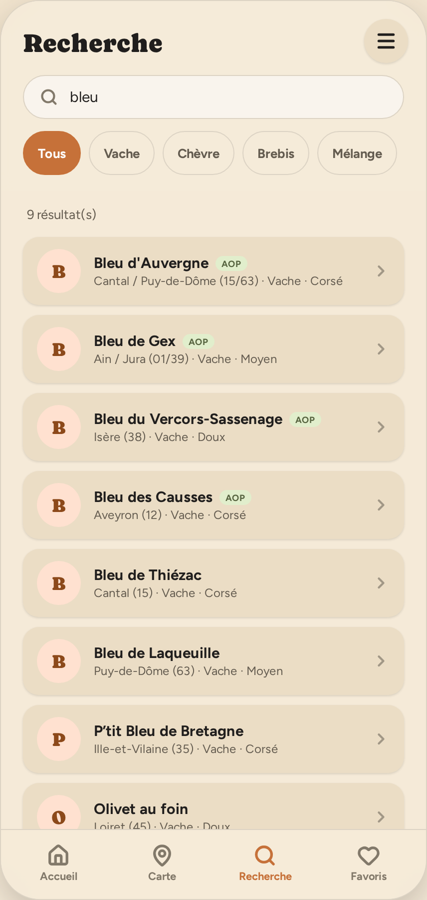 | 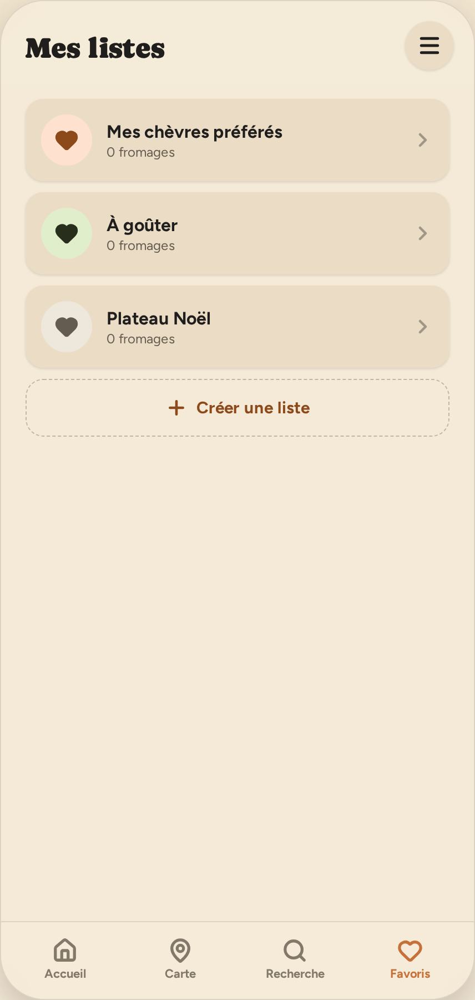 | 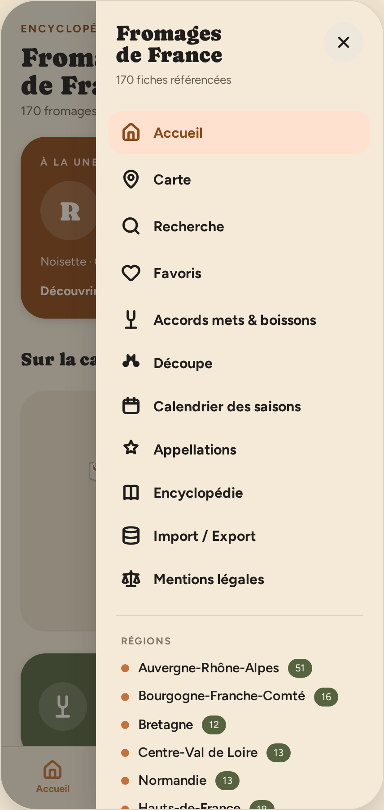 |

<details>
<summary><b>Voir les sept autres écrans</b> — accords, découpe, calendrier, appellations, encyclopédie, import/export, mentions légales</summary>

<br>

|                    🍷 Accords mets & boissons                   |                          🔪 Découpe                         |                     📅 Calendrier des saisons                    |
| :-------------------------------------------------------------: | :---------------------------------------------------------: | :--------------------------------------------------------------: |
| 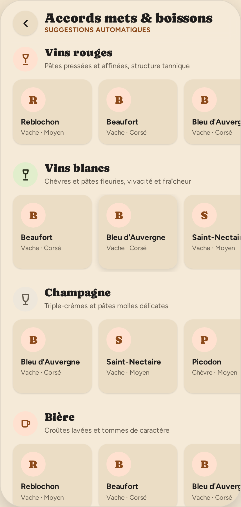 |  | 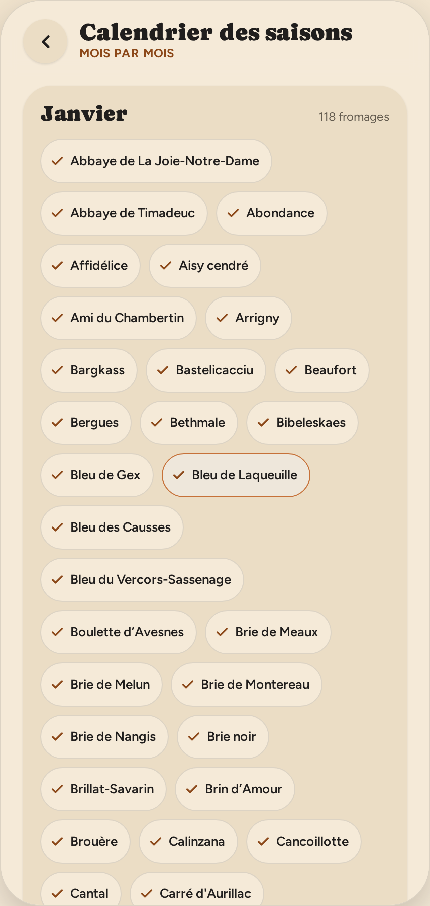 |
|                       **🏅 Appellations**                       |                     **📖 Encyclopédie**                     |                      **💾 Import / Export**                      |
| 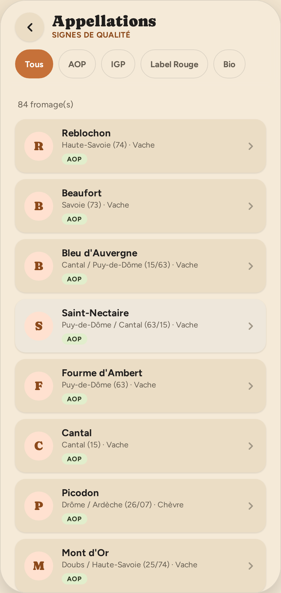 | 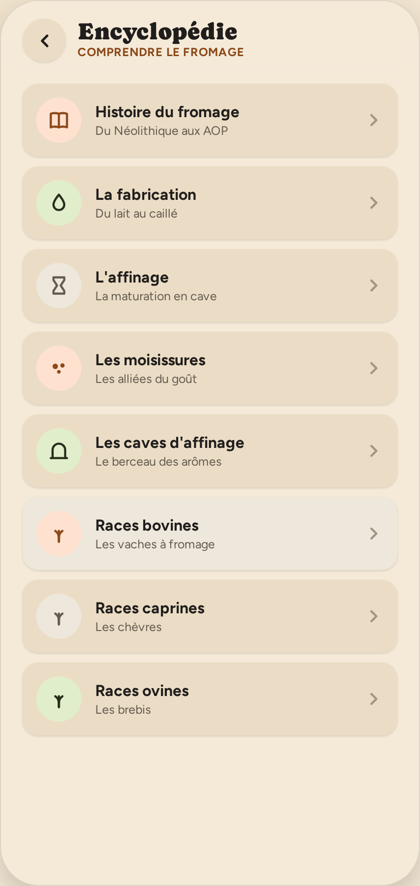 | 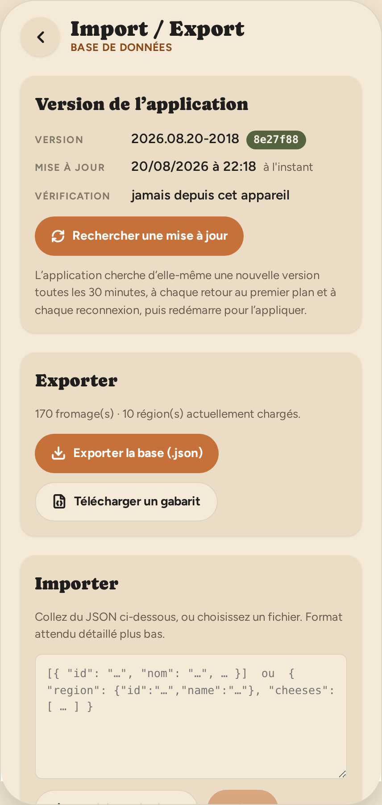 |
|                     **⚖️ Mentions légales**                     |                                                             |                                                                  |
| 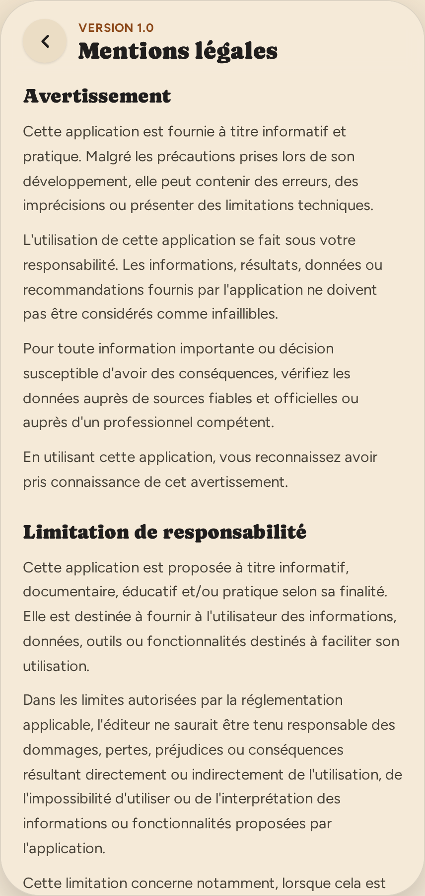 |  |  |

</details>

> Les captures sont régénérées par `scripts/screenshots.mjs` (voir [🎨 Logo & icônes](#-logo--icônes)).

## 🧭 Écrans

| Écran | Rôle |
| --- | --- |
| 🏠 **Accueil** | Fromage à la une, carte miniature, sélections de saison et populaires |
| 🧀 **Fiche détaillée** | Photo Wikimedia, intensité, notes aromatiques, carte d'identité, accords |
| 🗺️ **Carte de France** | Points par département, filtres AOP / lait / pâte |
| 🔍 **Recherche** | Plein texte sur nom, notes, région, appellation + filtres lait |
| ❤️ **Favoris** | Listes multiples, création et suppression, ajout depuis n'importe quelle fiche |
| 🍷 **Accords mets & boissons** | Suggestions automatiques par famille (vins, bières, cidres, miel…) |
| 🔪 **Découpe** | Le bon geste selon la forme du fromage |
| 📅 **Calendrier des saisons** | Les fromages à leur apogée, mois par mois |
| 🏅 **Appellations** | AOP, IGP, Label Rouge, Bio |
| 📖 **Encyclopédie** | Articles de fond : histoire, fabrication, affinage, races laitières |
| 💾 **Import / Export** | Sauvegarde et extension de la base depuis l'interface |
| ⚖️ **Mentions légales** | Avertissement, limitation de responsabilité, éditeur |
| ☰ **Menu latéral** | Navigation transverse + compteur par région |

## 🧱 Stack

- ⚛️ **React 19 + Vite + TypeScript**
- 🎨 **CSS Modules** + jetons du design system Organic (`src/styles/tokens.css`)
- 🖼️ `lucide-react` pour les icônes standards, icônes/diagrammes SVG portés à l'identique du handoff pour les glyphes propres au design
- 📱 **PWA** (`vite-plugin-pwa`) avec mise à jour automatique, polices Caprasimo/Figtree self-hostées (`@fontsource/*`)
- ✅ **Vitest** pour les tests de la logique métier (`src/lib/`) et des écrans légaux (`src/components/legal/`)

## 🚀 Démarrer

Node **>= 22.12** est requis (jsdom 30, utilisé par les tests, en dépend ; un `.nvmrc` est fourni) :

```bash
nvm use            # Node 22
npm install
npm run dev        # serveur de dev
```

| Commande | Ce qu'elle fait |
| --- | --- |
| `npm run dev` | Serveur de développement (http://localhost:5173) |
| `npm run build` | Build de production (+ typecheck) |
| `npm run preview` | Sert le build de production (http://localhost:4173) |
| `npm run typecheck` | Vérification des types seule |
| `npm run test` | Tests unitaires (Vitest) |
| `npm run lint` | oxlint |
| `npm run import-cheeses` | Régénère `src/data/{cheeses,fr-map}.ts` depuis un dossier de handoff (voir `scripts/import-cheeses.mjs`) |
| `npm run enrich-wikipedia` | Enrichit `src/data/cheeses.ts` avec photo + résumé Wikipédia (voir `scripts/enrich-wikipedia.mjs`) |
| `npm run enrich-wikipedia-extra` | Même chose pour les fromages ajoutés à la main → `src/data/cheeses-extra-media.ts` |

## 🧀 Données

`src/data/cheeses.ts` et `src/data/fr-map.ts` sont générés automatiquement depuis les fichiers `cheeses.js` / `fr-map.js` du dossier de handoff de design via `scripts/import-cheeses.mjs` — voir ce script pour ajouter une nouvelle région.

Le jeu de données actif est assemblé dans `src/data/dataset.ts` (`ALL_CHEESES`), consommé par `useCheeseDatabase` :

| Fichier | Écrit par | Contenu |
| --- | --- | --- |
| `cheeses.ts` | `import-cheeses.mjs` | Les 50 fromages du handoff |
| `cheeses-extra.ts` | **à la main** | Les fromages d'Auvergne-Rhône-Alpes ajoutés depuis (6), les noms alternatifs greffés sur des entrées générées, et les rattachements régionaux corrigés |
| `cheeses-bourgogne-franche-comte.ts` | **à la main** | Les 15 fromages de Bourgogne-Franche-Comté |
| `cheeses-bretagne.ts` | **à la main** | Les 12 fromages de Bretagne — aucun sous AOP, la région n'en compte pas |
| `cheeses-centre-val-de-loire.ts` | **à la main** | Les 13 fromages du Centre-Val de Loire, dont les 5 AOP caprines du Val de Loire |
| `cheeses-normandie.ts` | **à la main** | Les 13 fromages de Normandie, dont les 4 AOP à pâte molle |
| `cheeses-hauts-de-france.ts` | **à la main** | Les 18 fromages des Hauts-de-France, autour du Maroilles, seule AOP de la région |
| `cheeses-corse.ts` | **à la main** | Les 10 fromages de Corse, du Brocciu AOP aux cinq familles fermières |
| `cheeses-grand-est.ts` | **à la main** | Les 12 fromages du Grand Est — Munster, les pâtes pressées vosgiennes, plus le Chaource et le Langres rapatriés depuis la Bourgogne |
| `cheeses-ile-de-france.ts` | **à la main** | Les 11 fromages d'Île-de-France — le pays de Brie, ses deux AOP rapatriées depuis le Grand Est et leur descendance |
| `cheeses-occitanie.ts` | **à la main** | Les 12 fromages d'Occitanie — le roquefort et la brebis des causses, les tommes de vache du Couserans, les chèvres cévenoles et quercynoises ; le bleu des Causses et le laguiole les rejoignent depuis le jeu généré |
| `cheeses-extra-media.ts` | `enrich-wikipedia-extra.mjs` | Photos et résumés Wikipédia de tous les ajouts, tenus à part pour garder les fichiers écrits à la main lisibles |

Cette séparation existe parce que `import-cheeses.mjs` **réécrit intégralement** `cheeses.ts` : tout ce qui est ajouté à la main vit donc à côté, et survit à une régénération.

Le champ `map` d'un fromage écrit à la main doit tomber dans l'espace projeté de `FR_XY`. Faute de disposer de la projection d'origine, les coordonnées occitanes ont été obtenues en **ajustant un modèle quadratique sur une centaine de repères déjà placés** (résidu médian 0,5 unité, soit ~5 km), puis vérifiées point-dans-polygone contre `franceOutline.ts`. Placer un point à vue donne des écarts bien plus grands.

### ➕ Ajouter un fromage

1. Ajouter l'entrée dans le fichier de sa région (un `cheeses-<région>.ts`, ou un nouveau fichier déclaré dans `dataset.ts` et dans `scripts/enrich-wikipedia-extra.mjs`). Le type `Cheese` liste les champs attendus.
2. Renseigner `map: [x, y]` dans l'espace de `FR_XY` — la projection réelle, pas les coordonnées approximatives du handoff : les ajouts n'ont pas d'entrée dans `fr-map.ts` et retombent sur ce champ. Loin des fromages existants (tous à l'est), se caler sur les sommets de `franceOutline.ts` et vérifier que le point tombe bien à l'intérieur du contour.
3. `npm run enrich-wikipedia-extra` pour récupérer photo et résumé.
4. `npm run test` — `src/data/dataset.test.ts` refuse tout identifiant ou nom en double, vérifie la région et les bornes de la carte.

Pour une nouvelle **région**, ajouter aussi son entrée dans `src/data/regions.ts` : le menu latéral en tire la liste et le compteur par région, et l'accueil bascule de son nom vers « N régions » au-delà d'une.

### 📷 Enrichissement Wikipédia (photo + résumé)

`scripts/enrich-wikipedia.mjs` complète chaque fromage avec un champ `image` (photo + crédit, sourcée sur Wikimedia Commons) et un champ `wikipedia` (résumé + lien), tous deux optionnels sur le type `Cheese`. Il interroge l'API de Wikipédia en français par nom (puis noms alternatifs, puis `<nom> (fromage)`, puis une recherche plein texte en dernier recours), et rejette les correspondances qui ne sont pas réellement des articles de fromage (pages d'homonymie, communes du même nom, etc.).

- ⚠️ **Ré-exécuter après un import** : `import-cheeses.mjs` régénère `cheeses.ts` depuis le handoff et efface donc cet enrichissement — relancer `npm run enrich-wikipedia` ensuite.
- ♻️ Idempotent : ne re-télécharge pas les fromages déjà enrichis (`--force` pour tout re-télécharger, `--id <id>` pour un seul fromage).
- 🔗 Les photos restent hébergées sur `upload.wikimedia.org` (pas de copie locale) ; l'écran Fiche affiche le crédit (auteur + licence) en lien vers la page Commons du fichier.

## 🎨 Logo & icônes


Le logo est une **part de meule** crème sur fond terracotta, dessinée avec les couleurs du design system Organic (`--color-accent` `#c67139`, `--color-neutral-100` `#f9f4ed`). Il tient dans un carré arrondi et reste lisible jusqu'à 16 px.

<br clear="left">

| Fichier | Usage |
| --- | --- |
| `public/logo.svg` | Marque de référence (README, docs) |
| `public/favicon.svg` | Favicon — variante à deux ouvertures, plus lisible en 16 px |
| `public/pwa-icon.svg` | Icône PWA `purpose: any` |
| `public/pwa-icon-maskable.svg` | Icône PWA `purpose: maskable` (marque dans la zone sûre de 80 %) |
| `public/apple-touch-icon.png` | 180×180 — iOS ignore les icônes SVG |
| `public/pwa-icon-{192,512}.png`, `public/pwa-icon-maskable-512.png` | Replis PNG déclarés dans le manifeste pour les lanceurs Android |

Les PNG sont **dérivés des SVG** : après avoir modifié un SVG, relancer le rendu plutôt que de les retoucher à la main. Les deux scripts utilitaires s'appuient sur Playwright, volontairement **hors dépendances du projet** (outillage ponctuel) :

```bash
npx playwright@1.62.1 install chromium              # une seule fois

npx -p playwright@1.62.1 node scripts/render-icons.mjs   # SVG → PNG

npm run preview                                      # dans un autre terminal
npx -p playwright@1.62.1 node scripts/screenshots.mjs http://localhost:4173
```

## 🔄 Mise à jour automatique

L'application vérifie d'elle-même qu'une nouvelle version a été déployée, l'installe et redémarre — sans rien demander à l'utilisateur.

| Quand | Quoi |
| --- | --- |
| Toutes les **30 min**, au **retour au premier plan**, au **retour du réseau** | `registration.update()` : le navigateur va voir si `sw.js` a changé |
| **Bouton « Rechercher une mise à jour »** (Import / Export) | Même vérification, à la demande — et le garde-fou anti-boucle est levé pour l'occasion |
| Une nouvelle version est trouvée | Le service worker (`registerType: 'autoUpdate'`) l'installe et prend la main tout seul |
| La nouvelle version s'active | Onglet actif → bandeau « Nouvelle version installée » pendant 4 s, puis rechargement. Onglet en arrière-plan → rechargement immédiat, personne ne regarde |

- **Sans rechargement, rien ne change à l'écran** : le service worker sert bien les nouveaux fichiers, mais l'interface déjà chargée en mémoire reste l'ancienne. C'est ce rechargement que `src/pwa.ts` cadence.
- Le rechargement est **piloté par le projet**, pas par le plugin : fournir `onNeedReload` à `registerSW` débranche le rechargement immédiat que `vite-plugin-pwa` déclencherait sinon dès l'activation. C'est aussi ce qui évite un rechargement parasite à la toute première visite, quand le service worker s'installe.
- **Garde-fou anti-boucle** : deux rechargements à moins de 10 minutes d'intervalle sont ignorés — un déploiement cassé ne peut pas faire clignoter l'application indéfiniment. Passé ce délai, une app laissée ouverte suit bien les déploiements suivants.
- `netlify.toml` sert déjà `/sw.js` en `max-age=0, must-revalidate` : sans cela, le navigateur ne verrait jamais la nouvelle version.
- La logique de décision (`quand vérifier`, `quand recharger`) vit dans `src/lib/app-update.ts`, testée sans navigateur ; `src/pwa.ts` ne fait que la brancher sur les vraies API.

### 🔢 Version installée

L'écran **Import / Export** ouvre sur une carte « Version de l'application » : version, date du build, ancienneté de la dernière vérification, et un bouton pour en chercher une tout de suite. Elle répond à la question « est-ce que la mise à jour est bien arrivée sur mon téléphone ? », à laquelle rien ne permettait de répondre auparavant.

| | |
| --- | --- |
| **Version** | `2026.08.20-1834`, dérivée de la date du build — croissante, comparable, sans numéro à incrémenter à la main. Suivie du commit git court |
| **Mise à jour** | Date du build de la version qui tourne, dans le fuseau de l'appareil, avec son ancienneté |
| **Vérification** | Ancienneté du dernier contrôle abouti, automatique ou manuel (`fromages-maj-verifiee-le` dans `localStorage`) |

- Les deux constantes `__BUILD_TIME__` et `__BUILD_COMMIT__` sont injectées par Vite (`define`, dans `vite.config.ts`) et remplacées littéralement dans le bundle : rien n'est lu au démarrage. Leur type est déclaré dans `src/build-info.d.ts`, leur mise en forme testée dans `src/lib/app-version.ts`.
- Un build hors dépôt git affiche `inconnu` comme commit — la date suffit à identifier la version.
- **Une demande explicite lève le garde-fou anti-boucle** : si une version vient d'être installée mais que le rechargement a été écarté comme « trop tôt », appuyer sur le bouton la fait bien apparaître. C'était le cas de figure où une mise à jour pouvait rester invisible indéfiniment.
- Vérifié de bout en bout contre un vrai déploiement simulé : app ouverte et contrôlée par le service worker, v2 déployée pendant qu'elle tourne, bouton pressé, « Nouvelle version trouvée », redémarrage, nouvelle étiquette de version à l'écran.

## 🧮 Logique métier

Portée fidèlement dans `src/lib/` depuis le prototype de référence : parsing des saisons (`season.ts`), suggestions d'accords (`accords.ts`), appellations (`appellations.ts`), recherche plein texte (`search.ts`), favoris multi-listes avec migration (`favorites-storage.ts`).

## 💾 Import / Export de la base de fromages

Un écran dédié (accessible depuis le menu latéral) permet de sauvegarder et d'étendre la base de fromages depuis l'interface :

- 📤 **Export** du jeu de données actif au format JSON, ou téléchargement d'un exemple de gabarit pré-rempli.
- 📥 **Import** JSON (collé ou depuis un fichier), avec validation champ par champ avant application.
- 🗄️ Les données importées sont stockées dans une surcouche `localStorage`, fusionnée par-dessus les données intégrées (upsert par `id`) sans jamais modifier le jeu de données embarqué — voir `useCheeseDatabase`.
- 🌍 Accepte un simple tableau de fromages ou un objet `{ region?, cheeses[] }`, ce qui permet à un import d'enregistrer une nouvelle région.
- 📐 Schéma et validation : `src/lib/cheese-schema.ts`, `src/lib/cheese-import-export.ts` (testés).

## ⚖️ Mentions légales & avertissement

Un avertissement s'affiche **au tout premier lancement** ; sa validation est mémorisée localement et il ne réapparaît plus. Les mentions complètes restent accessibles en permanence depuis le **menu latéral → Mentions légales**.

| Fichier | Rôle |
| --- | --- |
| `src/lib/legal-notice.ts` | **Tout le contenu** : titre, avertissement court, sections, éditeur, version, drapeau `USES_GEOLOCATION` |
| `src/lib/legal-storage.ts` | Lecture / écriture / effacement de la validation dans `localStorage` |
| `src/components/legal/FirstLaunchNotice.tsx` | Modale de premier lancement (`role="dialog"`, piège de focus, retour Android) |
| `src/components/legal/LiabilityNotice.tsx` | Rendu des sections, partagé par la modale et l'écran |
| `src/components/legal/LegalScreen.tsx` | Écran complet, ouvert depuis le menu (motif `OverlayScreen`) |
| `src/components/legal/useDismissOnBack.ts` | Échap + bouton retour Android sur la vue détaillée |

**Stockage** — 100 % local, aucune donnée personnelle, aucun serveur :

| Clé `localStorage` | Valeur |
| --- | --- |
| `legal_notice_acknowledged` | `"true"` une fois l'avertissement validé |
| `legal_notice_acknowledged_version` | Version des mentions validée, ex. `"1.0"` |

- **Rejouer le premier lancement** : `npm run dev`, puis le bouton _« Réinitialiser les mentions légales (dév.) »_ en bas de l'écran Mentions légales. Il est derrière `import.meta.env.DEV` et **absent du bundle de production**. À défaut, effacer les deux clés ci-dessus dans les outils de développement du navigateur.
- **Modifier un texte** : tout se passe dans `src/lib/legal-notice.ts` — les composants ne contiennent aucun texte juridique. Les paragraphes du texte de limitation de responsabilité sont verrouillés par `src/lib/legal-notice.test.ts` : en perdre un fait échouer les tests.
- **Changer de version** : incrémenter `LEGAL_NOTICE_VERSION`. La politique actuelle (`needsAcknowledgement`, dans `legal-storage.ts`) **ne réaffiche pas** l'avertissement sur une simple montée de version — une retouche mineure ne doit pas re-solliciter tout le monde. La version validée étant déjà stockée, le jour où une modification importante le justifie il suffit de comparer `getAcknowledgedVersion()` à `LEGAL_NOTICE_VERSION`, sans migration.
- **Section GPS** : `USES_GEOLOCATION` est à `false` — l'application n'utilise ni géolocalisation, ni itinéraire, ni distance (la carte de France est une silhouette SVG décorative). Le jour où ce ne sera plus vrai, passer le drapeau à `true` fait apparaître d'elle-même la section « Précision de la localisation ».
- **Politique de confidentialité** : il n'y en a pas de séparée, l'application ne collectant aucune donnée. La section « Données personnelles » en tient lieu et sert de point d'accroche si un jour un compte, une mesure d'audience ou un formulaire l'imposent.
- **Identité de l'éditeur** : `legalPublisher`, dans `src/lib/legal-notice.ts` — nom, contact, adresse, hébergeur et date de mise à jour.

Ce système est volontairement autonome : le reprendre dans une autre PWA revient à copier `src/lib/legal-*.ts` et `src/components/legal/`, puis à réécrire le seul `legal-notice.ts`.

## ☁️ Déploiement

Le site est déployé sur Netlify : **[fromageor.netlify.app](https://fromageor.netlify.app)**. La configuration (commande de build, dossier de publication, en-têtes de cache) se trouve dans `netlify.toml`.
