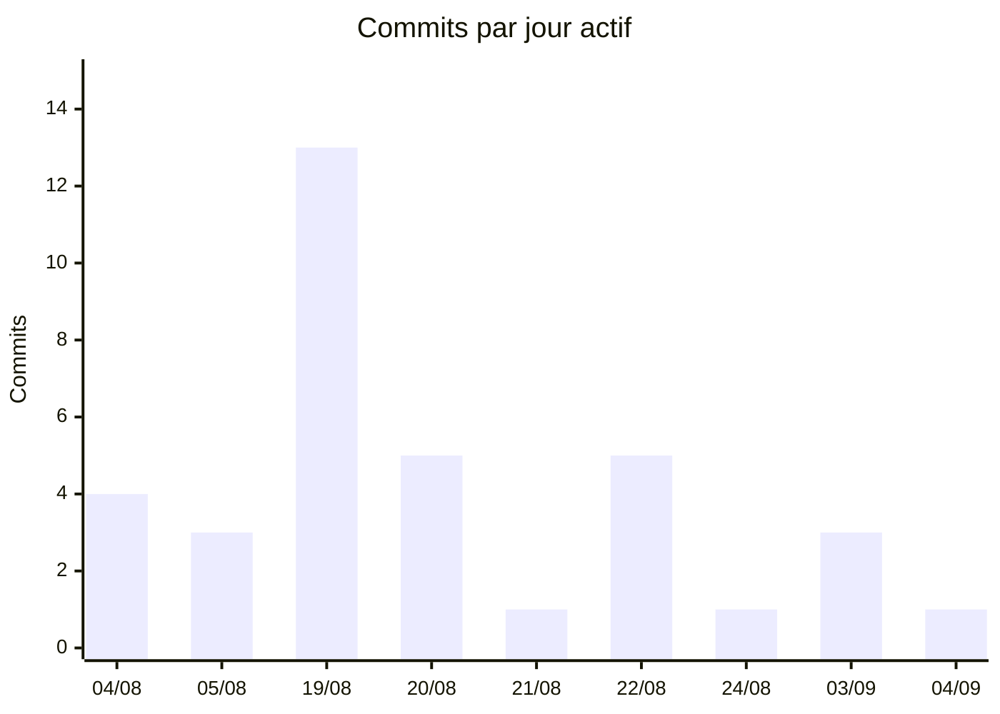
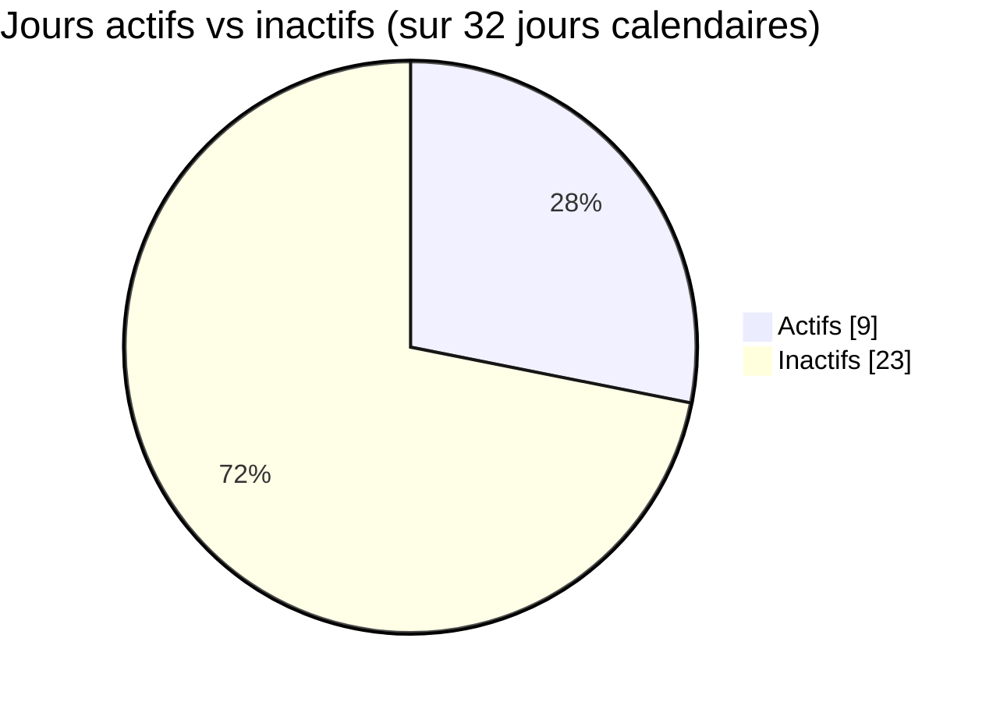
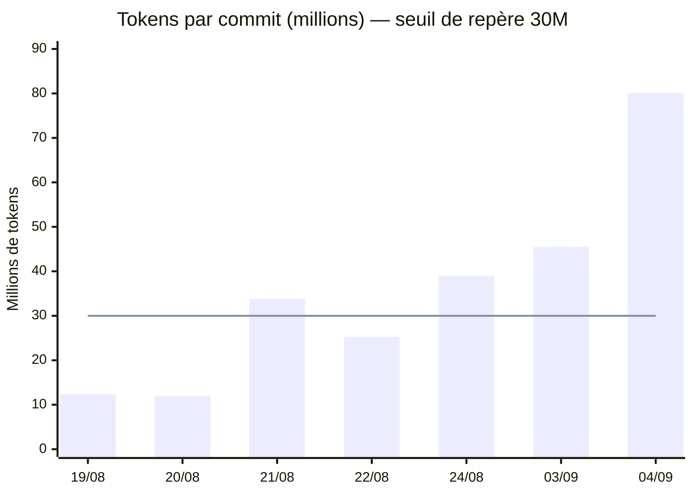
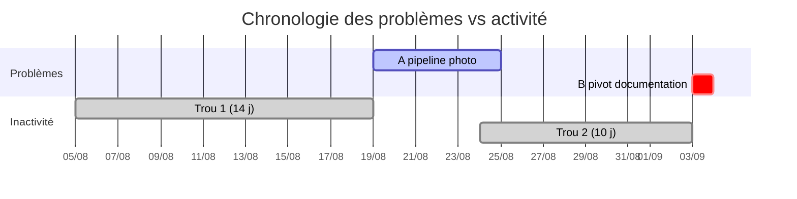
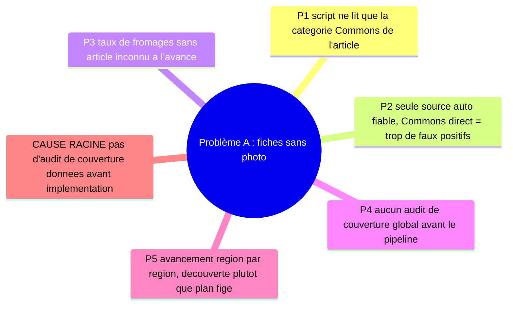
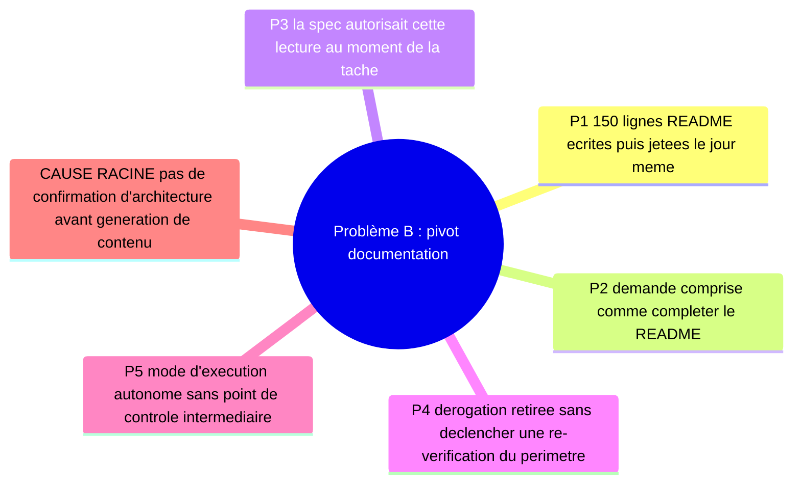

# RETEX — fromageor

Généré le 2026-09-04. Portée : tout l'historique disponible.

Analyse **sans blâme**, à but d'apprentissage. Le projet n'est pas terminé —
ce RETEX porte sur le processus, pas sur un bilan de clôture. Aucune échéance
n'étant fixée sur ce projet, aucune notion de retard n'est utilisée ici :
seulement de la durée, du rythme et des trous d'inactivité.

---

## 0. Résumé exécutif

**En bref —** fromageor : 13 régions métropolitaines / 216 fiches livrées sur
32 jours calendaires, dont 9 jours actifs (aucune échéance fixée, donc pas de
notion de retard). Budget ≈ **636 M tokens traités** (couverture *partielle* :
logs locaux disponibles à partir du 19/08 seulement, sur 9 jours actifs).
Enseignement principal : les deux frictions mesurées viennent de découvertes
tardives plutôt que d'erreurs d'exécution — un angle mort du pipeline photo
redécouvert plusieurs fois, et un pivot de documentation le 03/09 (150 lignes
ajoutées à `README.md` puis 146 supprimées le jour même). Action n°1 :
confirmer explicitement l'architecture cible **avant** d'écrire du contenu de
documentation piloté par une spec externe.

---

## 1. Objectifs initiaux vs résultats réels

**Intention de départ** (README du premier commit, 2026-08-04) :

> « Ce lot couvre la région **Auvergne-Rhône-Alpes** (50 fromages) et pose
> l'ossature UI/données pour ajouter d'autres régions ensuite. »

Écrans visés dès le départ : Accueil, Fiche détaillée, Recherche, Carte de
France, Favoris multi-listes, Accords mets & boissons, Découpe, Calendrier
des saisons, Appellations, Encyclopédie, Menu latéral — la liste d'écrans du
produit actuel était donc déjà arrêtée au premier commit.

| | Départ (04/08) | Aujourd'hui (04/09) |
|---|---|---|
| Régions | 1 (Auvergne-Rhône-Alpes) | **13/13 régions métropolitaines**, outre-mer explicitement hors périmètre |
| Fiches | 50 | 216 |
| Écrans | 11 prévus | 11 livrés + 2 non prévus (Import/Export, À propos) |
| Documentation | néant | Site statique dédié (`/docs/`, 46 pages) + README développeur + CONTEXT.md |
| Tests | non mesuré au départ | 394 tests (Vitest) |

**Écart** : l'ossature « pour ajouter d'autres régions ensuite » a été tenue
jusqu'au bout — c'est l'objectif le mieux atteint du projet. Deux éléments
n'étaient pas prévus au départ et ont émergé en cours de route : la mise à
jour PWA automatique (19-20/08) et le site de documentation (03-04/09), tous
deux ajoutés en réponse à des besoins découverts plutôt que planifiés — normal
pour un projet solo itératif, mais ça explique une partie du volume de
travail non anticipé au départ.

---

## 2. Métriques

### Git (l'artefact)

| Mesure | Valeur |
|---|---|
| Premier commit → dernier commit | 2026-08-04 → 2026-09-04 |
| Durée calendaire | 32 jours |
| Jours actifs (commits) | 9 |
| Ratio jours actifs / calendaires | **28 %** |
| Total commits | 36 |
| Vélocité | 4,0 commits / jour actif |
| Plus long trou d'inactivité | **14 jours** (05→19 août) |
| Deuxième trou | 10 jours (24 août → 03 sept.) |
| Taux correctif (mots-clés commit) | 2 / 36 = **5,6 %** (plancher, voir note) |
| Reverts | 0 |
| Auteurs | nouhailler / Patrick (même personne) : 35 · Claude (co-auteur) : 1 |

⚠️ Le taux correctif mesuré est un **plancher** : ce projet préfère des
titres de commit narratifs (« Add Hauts-de-France and Corse, and fix three
Wikipedia matching bugs ») à un préfixe `fix:` systématique, et plusieurs
corrections documentées dans `CONTEXT.md` (ex. persistance d'un mauvais
appariement Wikipédia sur la tomme d'Abondance) sont incluses dans des
commits dont le titre ne contient aucun mot-clé de correction.

| Date | Commits |
|---|---:|
| 04/08 | 4 |
| 05/08 | 3 |
| 19/08 | 13 |
| 20/08 | 5 |
| 21/08 | 1 |
| 22/08 | 5 |
| 24/08 | 1 |
| 03/09 | 3 |
| 04/09 | 1 |

**Hotspots** (fichiers les plus remaniés ; barres à l'échelle du maximum = README.md) :

| Fichier | Rév. | |
|---|---:|:--|
| `README.md` | 29 | ████████████████████ |
| `src/data/dataset.ts` | 15 | ██████████ |
| `src/data/dataset.test.ts` | 15 | ██████████ |
| `src/data/regions.ts` | 11 | ████████ |
| `src/data/cheeses-extra-media.ts` | 11 | ████████ |
| `scripts/enrich-wikipedia-extra.mjs` | 11 | ████████ |
| `CONTEXT.md` | 10 | ███████ |
| `scripts/enrich-wikipedia.mjs` | 9 | ██████ |
| `src/components/screens/Drawer.tsx` | 8 | ██████ |

(Les captures d'écran `docs/screenshots/*.png`, également très remaniées
9-11 fois chacune, sont omises : churn mécanique de régénération, pas un
signal de friction.)

`dataset.ts`/`dataset.test.ts`/`regions.ts` en tête est attendu (une entrée
par région, 13 fois). Le trio `enrich-wikipedia*` / `cheeses-extra-media.ts`
(31 révisions cumulées) est le vrai signal — voir §3, problème A.

### Claude Code (le processus)

⚠️ **Couverture partielle dans le temps.** Les logs locaux commencent le
**2026-08-19T12:45**, alors que le premier commit git date du **2026-08-04**.
Les 7 premiers commits (04-05 août) n'ont **aucune** session Claude Code
associée retrouvée localement — soit ce travail a été mené hors CLI/VS Code,
soit les logs ont été purgés/déplacés. Les métriques ci-dessous couvrent donc
**7 des 9 jours actifs**, pas la totalité. La journée du 04/09 est en outre
**en cours** au moment de l'extraction (ce RETEX lui-même y contribue).

| Mesure | Valeur |
|---|---|
| Sessions couvertes | 7 |
| Messages avec usage | 2 378 |
| Période couverte | 2026-08-19 → 2026-09-04 (partielle) |
| Tokens input | 4 746 |
| Tokens output | 2 838 573 |
| Tokens cache-create | 10 244 200 |
| Tokens cache-read | 623 105 430 |
| **Total** | **≈ 636,2 M** |
| Part servie par le cache | **98,0 %** |

Bon signe d'efficacité : sur 636 M de tokens traités, ≈13,1 M seulement
(input + output + cache-create) correspondent à du texte réellement nouveau
facturé plein tarif ; le reste est du cache relu à prix réduit.

**Par modèle** :

| Modèle | Cache-read | Output |
|---|---:|---:|
| claude-opus-5 | 411,6 M | 2,31 M |
| claude-sonnet-5 | 211,5 M | 0,52 M |

**Par mois** : août 2026 → 419,7 M · septembre 2026 (partiel) → 216,5 M

**Tokens par commit**, journées avec logs — la ligne pointillée marque un
seuil de repère à 30 M/commit (choix arbitraire, pas une norme mesurée) :

| Date | Commits | Tokens (M) | Tokens/commit (M) |
|---|---:|---:|---:|
| 19/08 | 13 | 160,8 | 12,4 |
| 20/08 | 5 | 59,8 | 12,0 |
| 21/08 | 1 | 33,8 | 33,8 |
| 22/08 | 5 | 126,4 | 25,3 |
| 24/08 | 1 | 39,0 | 39,0 |
| 03/09 | 3 | 136,4 | 45,5 |
| 04/09 | 1 | 80,1 | 80,1 (journée en cours) |

Le 21/08 et le 24/08 (un seul commit, coût élevé) correspondent à du travail
de recherche méthodique assumé (sourcer une région via les catégories
Wikipédia ; construire la logique de découpe) — pas de la friction. Le 03/09
est différent : voir §3. Le 04/09 mélange l'écran « À propos » et la
production de ce RETEX — pas comparable aux autres journées.

---

## 3. Chronologie des problèmes

### Problème A — Angle mort structurel du pipeline d'enrichissement photo (19→24 août)

Le script d'enrichissement part de l'article Wikipédia du fromage pour
trouver sa catégorie Commons ; un fromage sans article propre n'atteint donc
jamais Commons, même quand Commons a sa photo. Redécouvert plusieurs fois,
sous des formes différentes :
- alias générique (« Bonneval ») qui apparie le mauvais fromage,
- filtre de pertinence qui rejetait à tort des marques désignant un fromage
  (La Feuille du Limousin),
- un mauvais appariement qui **persistait** après resserrement du filtre
  (tomme d'Abondance gardait la photo de la tomme de Savoie), le script ne
  nettoyant pas les champs déjà écrits en cas de non-résultat.

Ampleur mesurée : 31 révisions cumulées sur 3 fichiers du pipeline, réparties
sur au moins 4 sessions distinctes.

### Problème B — Pivot de la documentation, même jour (03/09, 15h48 → 22h47)

Séquence mesurée :
1. **15h48** (`c69ea3b`) : 150 lignes ajoutées à `README.md` (FAQ, dépannage,
   changelog, limites, support), en s'appuyant sur une dérogation explicite
   de `DOCUMENTATION_SPEC.md` (§0bis) qui autorisait tout garder dans un seul
   fichier.
2. Entre les deux commits : l'utilisateur signale un malentendu de
   périmètre — la dérogation avait disparu de la spec, l'attente réelle
   étant l'architecture multi-pages du §3.
3. **22h47** (`4160d03`) : **146 des 150 lignes** ajoutées le matin sont
   supprimées et remplacées par un site statique de 46 pages (`docs-site/`).

Coût mesuré : cette journée a consommé 136,4 M tokens sur 3 commits
(45,5 M/commit), contre 12-25 M/commit sur des journées comparables.

---

## 4. Analyse des causes racines

**Problème A — hypothèse de cause racine** : absence d'un audit de couverture
(photo, résumé) fait sur l'ensemble du périmètre de données *avant*
l'implémentation détaillée du pipeline — les limites structurelles du script
ont donc été découvertes une fiche à la fois plutôt qu'une fois, globalement.

**Problème B — hypothèse de cause racine** : absence d'un point de
confirmation explicite sur l'architecture cible *avant* la génération de
contenu, dans un contexte où la source de vérité (la spec) autorisait
plusieurs lectures et pouvait changer sans préavis entre deux tâches.

---

## 5. Ce qui a bien fonctionné

Points forts **mesurés**, pas seulement ressentis :

- **Taux correctif bas et zéro revert** — 5,6 % de commits correctifs (déjà
  un plancher, voir §2), 0 revert sur 36 commits : peu de rework une fois le
  code posé.
- **Objectif initial tenu intégralement** — l'ossature « ajouter des régions
  ensuite » posée au premier commit a servi telle quelle jusqu'à la 13ᵉ
  région, sans refonte d'architecture de données.
- **Cache de contexte très efficace** — 98 % des tokens traités viennent du
  cache-read ; le coût marginal réel (≈13,1 M sur 636,2 M) reste faible en
  proportion du volume de travail couvert.
- **Méthode de sourcing rigoureuse maintenue** — partir des catégories
  Wikipédia et lire chaque article plutôt que d'écrire une fiche sur une
  intuition (règle du projet, `CONTEXT.md`) a un coût token direct (§2,
  21/08 et 24/08) mais explique aussi le zéro-revert : c'est un compromis
  qualité/coût assumé, pas un problème.
- **Passation de contexte disciplinée** — `CONTEXT.md` mis à jour à 10
  reprises comme mémoire de session à session (pièges connus, décisions
  prises), plutôt que reconstruit de mémoire à chaque reprise.
- **Vérifications systématiques avant de conclure** — 394 tests, lint et
  build recontrôlés à chaque étape livrée, cohérent avec la routine du
  projet (`npm test && npm run lint && npm run typecheck && npm run build`).

---

## 6. Plan d'action

| Action | Cause racine | Priorité | Effort | Impact | Horizon |
|---|---|---|---|---|---|
| Confirmer explicitement l'architecture cible avant d'écrire du contenu de documentation piloté par une spec | B | Haute | Faible | Élevé | Immédiat |
| Auditer la couverture d'un jeu de données sur l'ensemble du périmètre avant d'implémenter un pipeline dépendant d'une source externe | A | Haute | Moyen | Élevé | Prochain projet |
| Généraliser la pratique « pièges connus » (façon `CONTEXT.md`) dès le premier bug rencontré, pas après plusieurs occurrences | A | Moyenne | Faible | Moyen | En continu |
| Surveiller le ratio tokens/commit en cours de route comme signal de pivot ou de friction, pas seulement en RETEX rétrospectif | B | Moyenne | Faible | Moyen | En continu |
| Vérifier en début de session si une dérogation de spec externe est toujours valide avant de s'appuyer dessus | B | Moyenne | Faible | Moyen | Prochain projet |
| Conserver la pratique de commits atomiques et descriptifs | (point fort à préserver) | Basse | Faible | Élevé | En continu |
