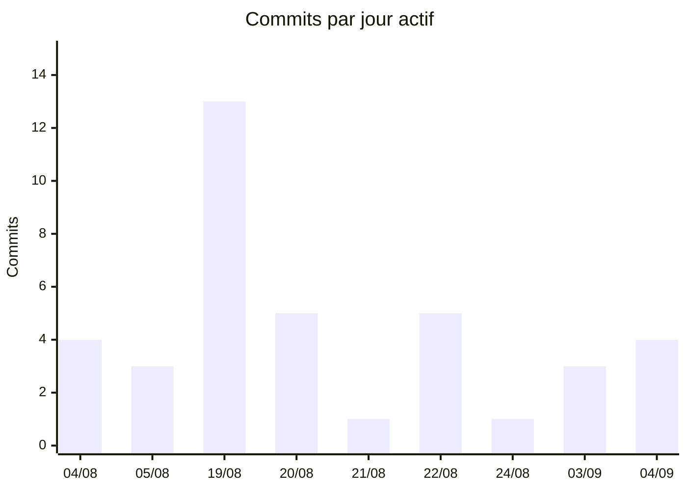
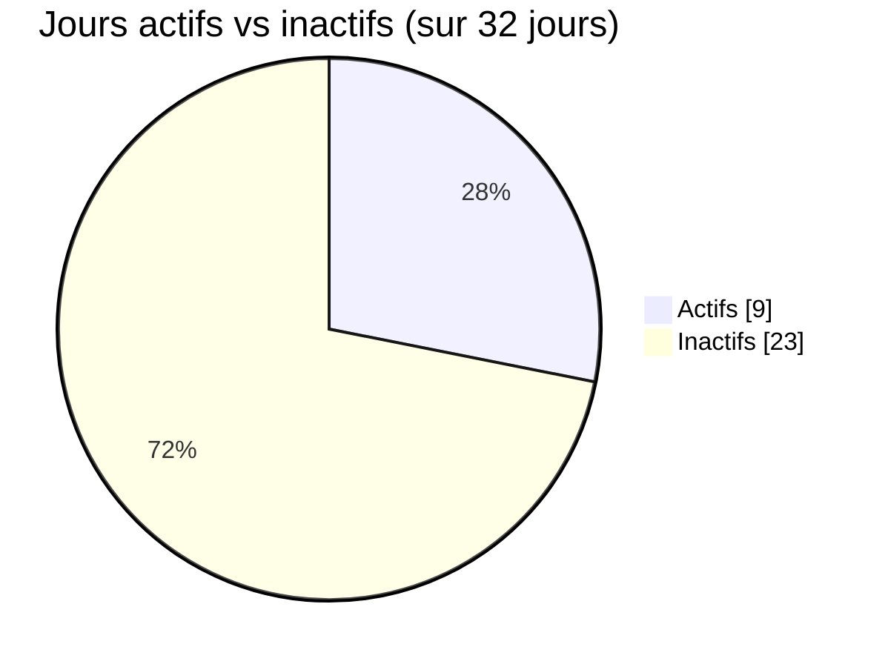
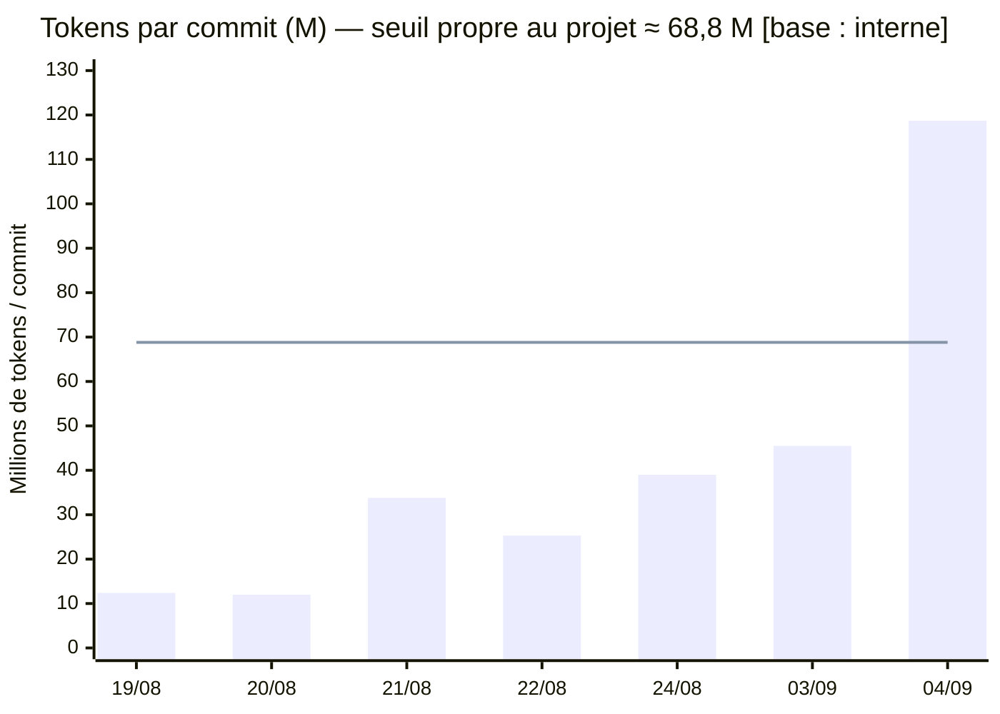
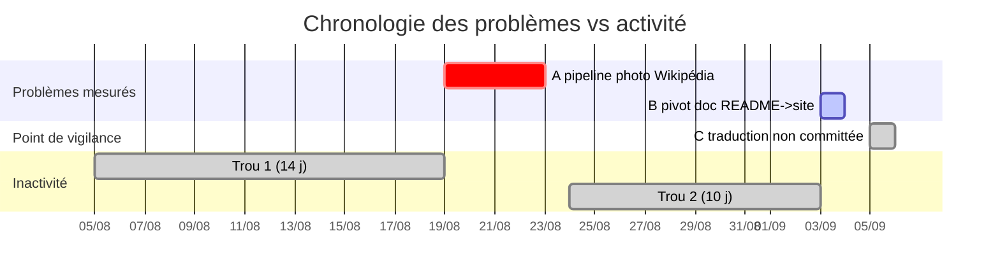
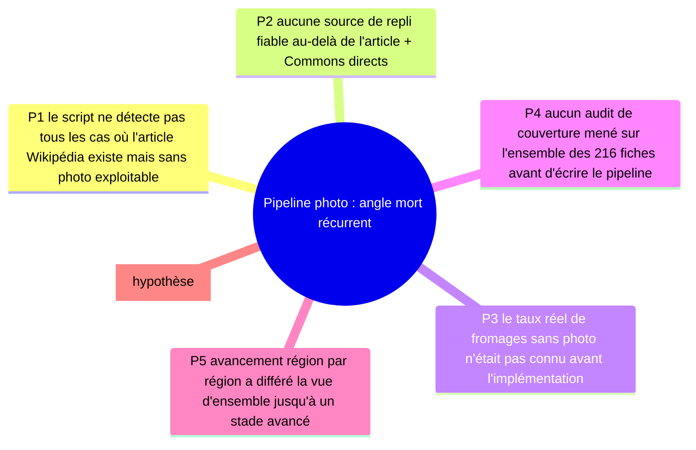
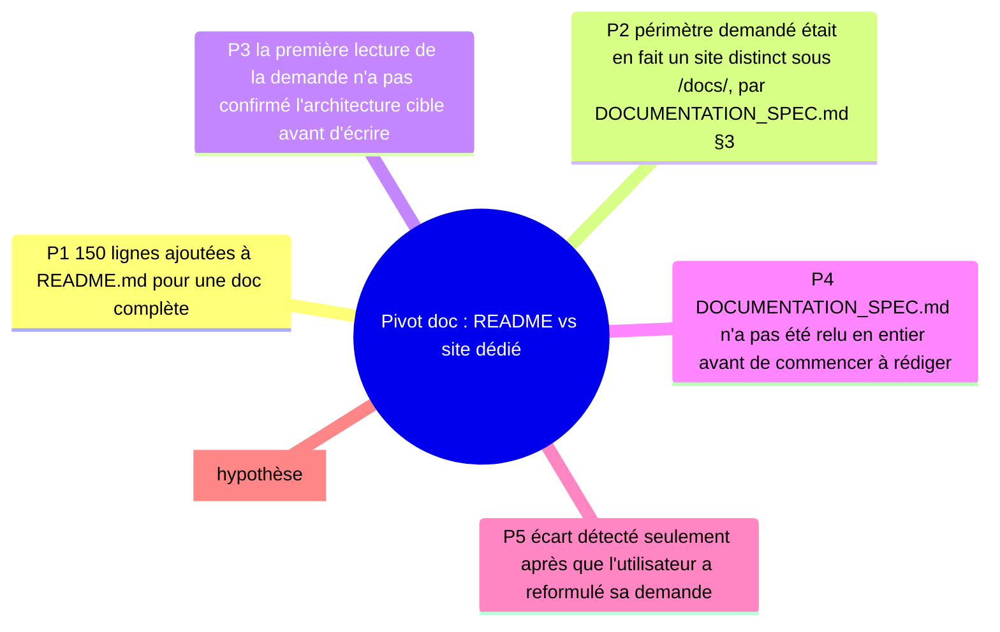

# RETEX — fromageor (2026-09-05)

Rétrospective sans blâme, portée : **tout l'historique** du dépôt. Ce n'est pas le premier
RETEX de ce projet — un premier existe déjà en date du 04/09/2026
(`docs/retex/RETEX-2026-09-04.md`) — celui-ci le met à jour avec les journées écoulées depuis,
et notamment une session de travail entière (05/09) qui n'a encore donné lieu à aucun commit.

**Légende des bases d'interprétation**, rappelée pour chaque chiffre qualifié :
- `[base : interne]` — comparé à la distribution mesurée de ce projet.
- `[base : portefeuille]` — comparé aux autres projets de l'utilisateur (indisponible ici).
- `[base : externe · indicatif]` — ancré à un repère public daté ; orientation, jamais verdict.
- `[factuel]` — fait mesuré ; `[hypothèse]` — cause déduite, non prouvée.

---

## 0. Résumé exécutif

Le dépôt a livré une PWA de fromages français couvrant les 13 régions métropolitaines
(216 fiches), avec interface bilingue FR/EN et — au terme de la session en cours — le contenu
des 216 fiches également traduit en anglais, sur 32 jours calendaires et 9 jours actifs (git)
[factuel] — aucune échéance n'étant fixée sur ce projet, on ne parle pas de retard. Budget :
≈ 1 279,6 M tokens traités par les sessions Claude Code retrouvées, dont 98,4 % servis par le
cache-read (couverture partielle, voir §2). Enseignement principal : la totalité de la
traduction anglaise du contenu (4 077 lignes, dont 3 877 dans un seul fichier) a été produite
sur la journée du 05/09 sans qu'aucun commit ne vienne la sécuriser en cours de route
[factuel]. Action n°1 : committer immédiatement après chaque unité de travail vérifiée
(ici, chaque région traduite), plutôt qu'en fin de séquence.

---

## 1. Objectifs vs résultats

| | Au premier commit (04/08/2026) | Aujourd'hui (05/09/2026) |
|---|---|---|
| Régions couvertes | 1 (Auvergne-Rhône-Alpes, 50 fromages annoncés) | 13/13 régions métropolitaines |
| Fiches | ~50 | 216 |
| Langue de l'interface | Français uniquement | FR/EN avec sélecteur |
| Langue du contenu des fiches | Français uniquement | FR/EN sur les 216 fiches (non committé) |
| Documentation | README seul | README + CONTEXT.md + site `/docs/` (46 pages) + mentions légales + écran À propos |
| Tests | Non mesuré au premier commit | 414 tests (Vitest) |

L'objectif initial affiché dans le tout premier README — « ce lot couvre
Auvergne-Rhône-Alpes et pose l'ossature pour ajouter d'autres régions ensuite » — a été tenu
intégralement et dépassé : les 13 régions ont été ajoutées une par une sans refonte de
l'architecture de données (`EXTRA_CHEESES`, `EXTRA_REGION_OVERRIDES`,
`EXTRA_TRANSLATIONS` — même patron de recollage réutilisé à chaque étape) [factuel].

---

## 2. Métriques

### Git (l'artefact)

| Mesure | Valeur |
|---|---|
| Premier commit | 2026-08-04 |
| Dernier commit | 2026-09-04 |
| Durée calendaire | 32 jours |
| Jours actifs (commits) | 9 |
| Ratio jours actifs / calendaires | 28,1 % `[base : interne]` — seule mesure disponible pour ce projet à ce jour, sert de référence pour les prochains RETEX, pas de verdict porté ici |
| Commits totaux | 39 |
| Vélocité | 4,3 commits / jour actif |
| Taux correctif (mots-clés fix/bug/hotfix/revert/patch) | 5,1 % (2/39) — plancher, les titres de commit sont narratifs et sous-comptent probablement le rework réel |
| Reverts | 0 |
| Plus long trou d'inactivité (commits) | 14 jours (05/08 → 19/08) |
| Deuxième trou | 10 jours (24/08 → 03/09) |
| Auteurs (HEAD) | nouhailler : 35 · Patrick : 3 · Claude : 1 |

**Commits par jour actif :**

| Jour | Commits |
|---|---:|
| 04/08 | 4 |
| 05/08 | 3 |
| 19/08 | 13 |
| 20/08 | 5 |
| 21/08 | 1 |
| 22/08 | 5 |
| 24/08 | 1 |
| 03/09 | 3 |
| 04/09 | 4 |

**Jours actifs vs inactifs (sur 32 jours calendaires) :**

**Hotspots** (fichiers les plus révisés, hors captures d'écran binaires) — barres à l'échelle,
max = 20 blocs pour 30 révisions :

| Fichier | Rév. | |
|---|---:|:--|
| README.md | 30 | ████████████████████ |
| src/data/dataset.ts | 15 | ██████████ |
| src/data/dataset.test.ts | 15 | ██████████ |
| src/data/regions.ts | 11 | ███████ |
| src/data/cheeses-extra-media.ts | 11 | ███████ |
| scripts/enrich-wikipedia-extra.mjs | 11 | ███████ |
| CONTEXT.md | 11 | ███████ |
| src/components/screens/Drawer.tsx | 9 | ██████ |
| scripts/enrich-wikipedia.mjs | 9 | ██████ |
| src/components/screens/CheeseDetailScreen.tsx | 8 | █████ |
| src/data/cheeses-extra.ts | 7 | █████ |
| src/components/screens/CheeseDetailScreen.module.css | 7 | █████ |
| vite.config.ts | 6 | ████ |
| src/lib/cheese-schema.ts | 6 | ████ |

### Claude Code (le processus)

**Couverture partielle** [factuel] : les logs locaux disponibles ne commencent que le
2026-08-19T12:45Z. Les 7 premiers commits (04–05 août) n'ont aucune session associée
retrouvée. Toute interprétation ci-dessous porte uniquement sur les jours couverts.

| Mesure | Valeur |
|---|---|
| Sessions retrouvées | 7 |
| Messages avec usage token | 3 526 |
| Période couverte | 2026-08-19 → 2026-09-05 (en cours) |
| Tokens d'entrée | 7 040 |
| Tokens de sortie | 3 951 315 |
| Tokens de création de cache | 16 069 774 |
| Tokens de lecture de cache | 1 259 591 490 |
| **Total traité** | **1 279 619 619** (≈ 1 279,6 M) |
| Part servie par le cache-read | 98,4 % `[base : interne]` — cohérent avec le 98,0 % mesuré au RETEX précédent, la pratique ne s'est pas dégradée |
| Répartition par modèle | Opus 5 : 419,7 M (32,8 %) · Sonnet 5 : 859,9 M (67,2 %) |

Fait notable [factuel] : la totalité des 419,7 M tokens d'août provient du modèle Opus 5, et la
totalité des 859,9 M tokens de septembre provient du modèle Sonnet 5 — aucun mélange de modèle
au sein d'un même mois dans les logs retrouvés. La cause de ce basculement net n'est pas
determinable depuis ces seules données `[hypothèse]`.

**Tokens par jour, avec le seuil d'aberration propre au projet** (médiane + 3×MAD sur les 7
jours où commits et tokens sont tous deux mesurés ; 04/08, 05/08 et 05/09 exclus, faute de
tokens ou de commit associés) :

| Jour | Commits | Tokens (M) | Tokens/commit (M) |
|---|---:|---:|---:|
| 19/08 | 13 | 160,8 | 12,4 |
| 20/08 | 5 | 59,8 | 12,0 |
| 21/08 | 1 | 33,8 | 33,8 |
| 22/08 | 5 | 126,4 | 25,3 |
| 24/08 | 1 | 39,0 | 39,0 |
| 03/09 | 3 | 136,4 | 45,5 |
| **04/09** | 4 | 474,9 | **118,7 — au-dessus du seuil** |
| 05/09 (en cours) | 0 | 248,6 | non calculable — aucun commit à ce jour |

Seul le 04/09 dépasse le seuil dérivé (médiane 33,8 M + 3×MAD 11,65 M ≈ 68,8 M)
`[base : interne]` : c'est un pic pour ce projet, pas « cher » dans l'absolu. Le 05/09
n'apparaît pas dans ce calcul faute de commit à rapporter aux tokens consommés — voir §7.

---

## 3. Chronologie des problèmes vs activité

Deux frictions mesurées sur l'historique complet (déjà identifiées au RETEX du 04/09, toujours
les deux seules à ce jour), plus la situation du 05/09 qui n'est pas un problème au sens strict
(aucune reprise, aucun test en échec) mais un point de vigilance factuel :

---

## 4. Analyse des causes racines

### Problème A — angle mort récurrent du pipeline photo/Wikipédia

11 révisions cumulées sur `scripts/enrich-wikipedia-extra.mjs` seul, plus 9 sur
`scripts/enrich-wikipedia.mjs`, sur l'historique complet `[factuel]` — signe d'un problème
redécouvert plutôt que résolu une fois pour toutes.

### Problème B — pivot documentation le 03/09

146 des 150 lignes ajoutées à README.md le 03/09 ont été retirées le même jour, à environ 7h
d'écart `[factuel]` — la journée affiche 45,5 M tokens/commit contre 12–25 M sur les journées
comparables sans pivot `[base : interne]`.

---

## 5. Ce qui a bien fonctionné

- **Zéro revert sur 39 commits**, taux correctif mesuré bas (5,1 %) `[factuel]` — même lecture
  qu'au RETEX précédent, la pratique s'est maintenue sur les 3 commits supplémentaires depuis.
- **98,4 % des tokens traités servis par le cache-read** `[base : interne]`, en légère hausse
  sur le 98,0 % du RETEX précédent — le coût marginal réel (input + output + cache-create)
  reste proche de 20,0 M tokens sur 1 279,6 M traités.
- **Architecture de recollage réutilisée sans changement structurel** : `EXTRA_CHEESES`,
  `EXTRA_REGION_OVERRIDES`, `EXTRA_EDITORIAL` puis `EXTRA_TRANSLATIONS` suivent le même patron
  depuis la première région jusqu'à la treizième `[factuel]` — aucune des 12 traductions
  région par région n'a demandé de modification de `dataset.ts` au-delà du branchement initial.
- **Garde-fous de test étendus au même rythme que les données** : chaque région ajoutée, puis
  chaque région traduite, a reçu son `it()` de couverture dans `dataset.test.ts`, jusqu'à un
  garde-fou global sur les 216 fiches `[factuel]`.
- **Vérification systématique en navigateur** avant de considérer une tâche terminée (recherche
  d'un fromage par région, bascule FR/EN, lecture de la fiche) sur chacune des 13 régions
  traduites `[factuel]`.

---

## 6. Plan d'action

| Action | Cause racine | Priorité | Effort | Impact | Horizon |
|---|---|---|---|---|---|
| Committer immédiatement après chaque unité de travail vérifiée (ici : chaque région) au lieu d'accumuler | Aucun point de sauvegarde intermédiaire sur 4 077 lignes de travail du 05/09 | Haute | Faible | Élevé (réduit le risque de perte, facilite la revue) | Immédiat |
| Auditer la couverture d'un jeu de données sur sa totalité avant d'implémenter un pipeline dépendant d'une source externe | Cause racine du problème A | Moyenne | Moyen | Élevé (évite les redécouvertes successives) | Prochain projet similaire |
| Confirmer explicitement l'architecture cible avant de rédiger du contenu piloté par une spec externe | Cause racine du problème B | Moyenne | Faible | Moyen | Prochain projet piloté par spec |
| Surveiller le ratio tokens/commit en cours de route comme signal de pivot ou de session longue sans commit | Le 05/09 n'apparaît dans aucune métrique tokens/commit faute de commit | Basse | Faible | Moyen (signal précoce) | En continu |
| Documenter dans CONTEXT.md, à chaque session, l'état des fichiers non committés en fin de session | Le lecteur du prochain RETEX ou de la prochaine session ne peut pas déduire l'état du working tree depuis git seul | Basse | Faible | Moyen | En continu |

---

## 7. Lecture des chiffres

- **Interprété en interne `[base : interne]`** : le seuil d'aberration tokens/commit (≈ 68,8 M),
  la part de cache-read (98,4 %, stable par rapport au RETEX précédent), le ratio jours
  actifs/calendaires (28,1 %) — toutes ces lectures comparent le projet à sa propre
  distribution mesurée, la seule disponible à ce jour.
- **Interprété en portefeuille `[base : portefeuille]`** : aucune lecture — pas de baseline
  portefeuille trouvée (`~/.claude/retex/portfolio-baseline.json` absent). Lancer
  `/meta-retex` pour la débloquer.
- **Ancré en externe `[base : externe · indicatif]`** : aucune ancre externe mobilisée dans ce
  RETEX — le volume traité (1,28 Md tokens sur 9 jours actifs) n'a pas d'équivalent direct et
  fiable dans les repères publics mi-2026 disponibles sans hypothèse supplémentaire sur le mix
  de modèles ; mieux vaut le rapporter brut que de forcer une comparaison.
- **Non interprétable sans référentiel** : le 05/09 n'a ni commit ni tokens/commit — c'est un
  fait rapporté brut (248,6 M tokens, 0 commit), pas un jour « cher » ou « normal » : aucune
  base de comparaison ne s'applique à une journée sans commit.

---

**Fichiers** : ce rapport (`docs/retex/RETEX-2026-09-05.md`) et son JSON associé
(`docs/retex/retex-metrics-2026-09-05.json`).

**Résumé en 3 lignes** : 13/13 régions et 216 fiches livrées sur 32 jours calendaires / 9 jours
actifs, sans notion de retard ; 1 279,6 M tokens traités, 98,4 % servis par le cache ; le
principal enseignement de cette mise à jour est que 4 077 lignes de traduction restent
non committées à l'instant du rapport — à corriger en premier.
